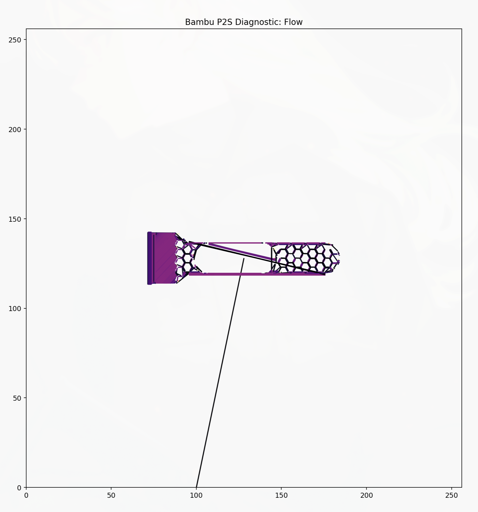
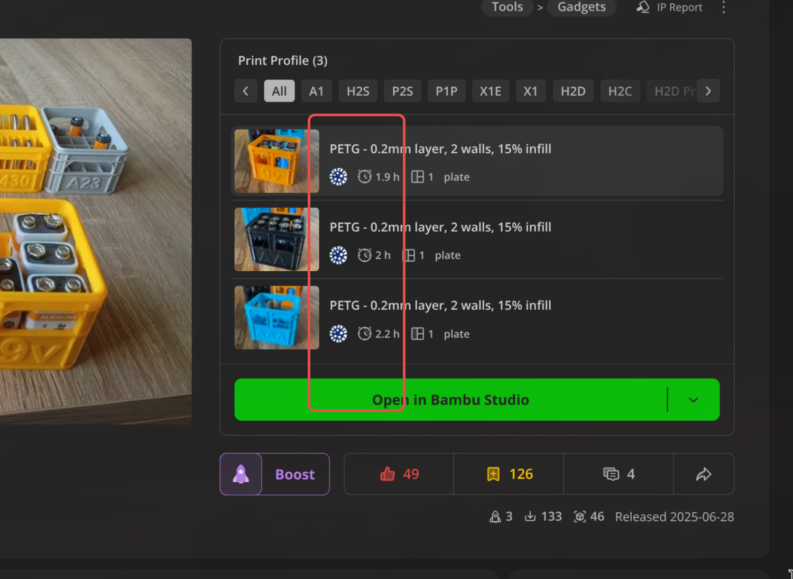
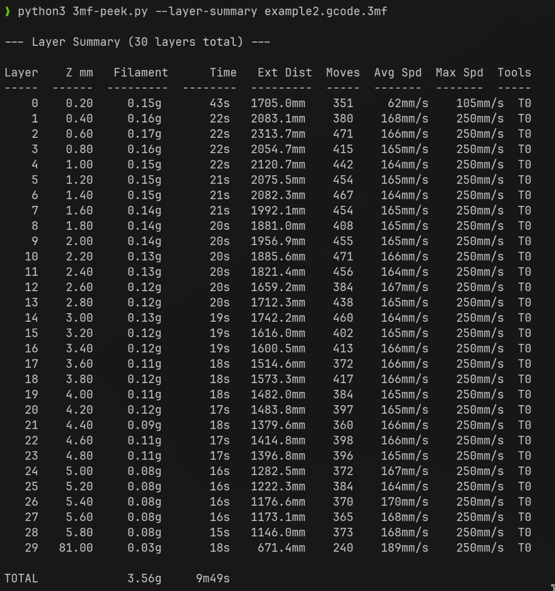

# 3mf-peek

Ultimately, a swiss-army knife for playing around with .3mf files.

An idea developed with Google Gemini initially (1st commit), although quite buggy.

Currently it:
- prints interesting, commonly used stats (e.g., wall loops)


- plots the first N levels of gcode in matplotlib



- dumps G-code with human-readable annotations as a Markdown table (`--dump-gcode [N]`):
  ```bash
  python3 3mf-peek.py --dump-gcode 1000 example1.gcode.3mf | glow -w 160
  ```



- dumps per layer summaries (`--layer-summary`):



Refs:
- example1.gcode.3mf is a modified, SLICED version of 3mf from:
  https://makerworld.com/en/models/1889081-geometric-line-art-bookmarks
- example2.gcode.3mf is SLICED version of 3mf from:
  https://makerworld.com/en/models/511342-bambu-lab-p1s-x1-x1c-door-handle-bed-scraper

